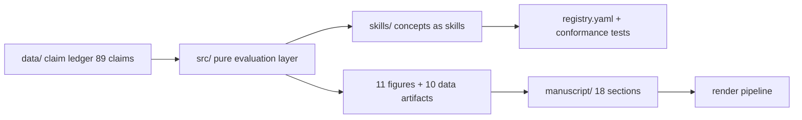

# Agentic Security and Operating Systems

**A Deep Review and Prospectus of OpSec, Cognitive Security, and Agentic Cyber Security in the Emerging Present and Future**

[](https://doi.org/10.5281/zenodo.22754352)
[](https://zenodo.org/records/22754352)


**Daniel Ari Friedman** · Active Inference Institute · [ORCID 0000-0001-6232-9096](https://orcid.org/0000-0001-6232-9096)

**Cite:** Friedman, Daniel Ari (2026). *Agentic Security and Operating Systems* (v0.7.0). Zenodo. https://doi.org/10.5281/zenodo.22754352

> **The one-paragraph version.** AI agents now hold genuine system authority: they execute code, touch credentials, open egress, parse hostile documents, and often initiate or approve changes to the infrastructure they run on. This review examines what that shift does to operating-system security through two failure paths — **exploitation** (an attacker crosses a boundary) and **authorized misuse** (an attacker persuades an agent to use its legitimate access; no kernel exploit required). Twenty-four operating systems are evaluated against **nine security properties** (216 stance cells, no numeric scores), anchored by deep reviews of Qubes OS and NixOS, and extended into three domains: **cognitive security** (the authorized-misuse surface), **operator OpSec**, and **agent-orchestration security**. The composition thesis: Qubes-like containment + Nix-like reproducibility + verified boot + capability-limited agents — one design target, not one product.

**Published:** [Zenodo record 22754352](https://zenodo.org/records/22754352) · [DOI 10.5281/zenodo.22754352](https://doi.org/10.5281/zenodo.22754352) · 57-page PDF with graphical-abstract cover · open access.

---

## What is in this repository

| Surface | What it holds |
| --- | --- |
| `manuscript/` | 18-section modular manuscript (17 numbered sections + references), 168-entry bibliography, 12 tables, 11 figures |
| `src/agentic_os_security/` | Pure evaluation layer: 24×9 stance matrix, 155-source evidence registry, threat model + authority ladder, 7 trust domains, 9 controls, 8-layer OS stack, mediation points, CIF concept map, 8 formal definitions |
| `skills/` | **Concepts as skills** — 9 harness-neutral SKILL.md definitions with a registry and conformance tests |
| `output/` | Regenerated figures (11 + cover), data artifacts (12), reports, rendered PDF |
| `data/` | Claim ledger (89 sourced claims) |
| `tests/` | 156 zero-mock tests, 95.77% coverage on `src/` |

## The evaluation at a glance

| Candidate class | Stance profile |
| --- | --- |
| Compartmentalized | 2 strong / 7 partial |
| Reproducible | 1 strong / 5 partial / 3 weak |
| Desktop | 7 strong / 34 partial / 22 weak |
| Server | 13 strong / 37 partial / 13 weak |
| Anonymity | 1 strong / 10 partial / 7 weak |
| High assurance | 4 strong / 14 partial / 3 weak / 6 not assessed |
| Mobile | 2 strong / 7 partial |
| Offensive toolkit | 8 partial / 10 weak |

## Concepts as skills

Every core concept of the review is available both as prose and as a **harness-neutral skill** — a machine-checkable SKILL.md with a registry entry and conformance tests, following the [CogSecSkills](https://github.com/docxology/CogSecSkills) doctrine (DOI [10.5281/zenodo.21520558](https://doi.org/10.5281/zenodo.21520558)):

`stance-evaluation` · `authority-ladder` · `trust-domain-design` · `delegation-bound` · `mediation-selection` · `incident-lessons` · `scenario-selection` · `configuration-invariants` · `defensive-stack`

Each skill names the manuscript section it operationalizes, the data artifact that regenerates it, and the test that pins it. Drop a skill into any agent harness to apply the review's vocabulary directly.

## Quickstart

```bash
uv sync
uv run python scripts/00_preflight.py
uv run python scripts/10_evaluation_analysis.py      # evaluation matrix + 11 figures + validation
uv run python scripts/z_generate_manuscript_variables.py
uv run pytest tests/ --cov=src --cov-fail-under=90
```

Render the PDF from the [template repository](https://github.com/docxology/template) with this project linked under `projects/working/`.

## Repository map



## Claim boundaries

Assessments are **analytical judgments from documented designs, advisories, and incident reports** — not results of a comparative penetration test. No numeric security scores ("Qubes 9.4"-style) are assigned; stances are qualitative (`strong / partial / weak / not-assessed`). Vendor findings are labeled as vendor findings. The absence of a confirmed feature in this review is not proof that the feature is unavailable.

## Related works by the author

- [CogSecSkills: Multiharness Agentic Skills for Cognitive Security](https://doi.org/10.5281/zenodo.21520558) — the skills doctrine this repository follows
- [Cognitive Integrity Framework Part 1: Formal Foundations](https://doi.org/10.5281/zenodo.22134544) · [Part 2](https://doi.org/10.5281/zenodo.18364128) · [Part 3](https://doi.org/10.5281/zenodo.22134548)
- [AGEINT: Agentic Intelligence Curriculum](https://doi.org/10.5281/zenodo.20732274)

## License

MIT © 2026 Daniel Ari Friedman
