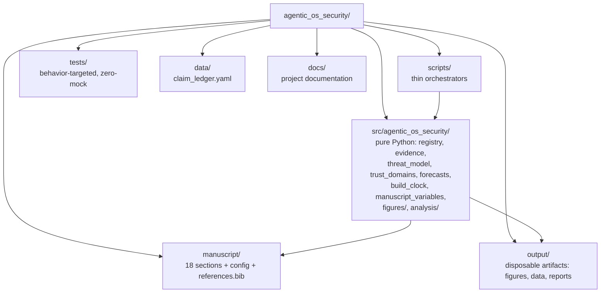

# agentic_os_security

**Agentic Security and Operating Systems** — *A Deep Review and Prospectus of OpSec, Cognitive Security, and Agentic Cyber Security in the Emerging Present and Future*

A standalone, private research project that produces a deep review and prospectus manuscript. It evaluates how contemporary operating systems — compartmentalized, reproducible, hardened, and conventional — stand up to offensive AI agents, and it extends that evaluation with three analytical domains the source literature only touches implicitly: **cognitive security**, **operator OpSec**, and **agentic cyber security** (securing the orchestration layer itself).

## What the project does

- **Evaluation matrix.** Scores 24 OS candidates against 9 properties (`containment`, `authority`, `trusted_computing_base`, `application_confinement`, `integrity`, `persistence_recovery`, `update_operations`, `supply_chain_trust`, `human_usability`) with qualitative stances (`strong | partial | weak | n_a`) — never numeric security scores — across 8 operational scenarios.
- **Evidence registry.** 150 documented sources (official docs, advisories, incident reports, research, community) with an explicit capability baseline, plus an 8-class mitigation/defensive-stack matrix, documented update windows, and a 10-point agent mediation taxonomy.
- **Agentic authority architecture.** 7 trust domains, 9 controls, 9 configuration invariants an agent must never be able to violate.
- **Forecast.** Confidence-tiered (high/moderate/low) predictions for 2028–2031.
- **Manuscript.** 18 Pandoc-markdown sections hydrated from a deterministic token pipeline and rendered to PDF/HTML from a sibling template repository.

All assessments are **analytical judgments from documented designs**. There is no penetration testing, no exploit development, and no numeric scoring in this project.

## Structure



## Install

From the project root (the repo is standalone; it is not part of any uv workspace):

```bash
uv sync
```

Requires Python ≥ 3.10. Dependencies: numpy, matplotlib, pillow, pyyaml, defusedxml; dev extras add pytest and pytest-cov.

## Quickstart

```bash
uv run python scripts/00_preflight.py            # environment, deps, directory checks
uv run python scripts/10_evaluation_analysis.py  # evaluation matrix + 9 figures + validation report
uv run python scripts/z_generate_manuscript_variables.py  # token pipeline -> output/data/manuscript_variables.json
uv run pytest tests/ --cov=src --cov-fail-under=90        # ≥90% coverage gate on src/
```

## Rendering the manuscript

This project does **not** contain a render pipeline. It lives (via symlink) at `projects/ongoing/Agentic/agentic_os_security` inside the sibling template repository, and rendering happens from that template environment with the project linked under `projects/working/`:

```bash
uv run python scripts/pipeline/stage_03_render.py --project working/agentic_os_security
```

Run from the template repo root. The `z_generate_manuscript_variables.py` script detects the template environment and injects resolved manuscript variables there; in standalone mode it writes `output/data/manuscript_variables.json` and skips injection. The manuscript avoids mermaid blocks so the Pandoc render chain has no diagram prerequisites.

## Claim boundaries

- Every assessment in the manuscript and the registry is an analytical judgment derived from documented designs, public advisories, and incident reports — **not** from penetration testing or original offensive work.
- Vendor findings are labeled as vendor findings (e.g., the Anthropic campaign report describes the vendor's own investigation; AISI results come from its own incident report).
- Forecasts are distinguished from measurements; confidence is stated explicitly.
- No numeric security scores ("Qubes 9.4" style) are assigned, anywhere.
- **Private posture.** This repository is private. There is no DOI, no Zenodo deposit, no public metadata, and no publishing actions should be taken without the owner's explicit request.
