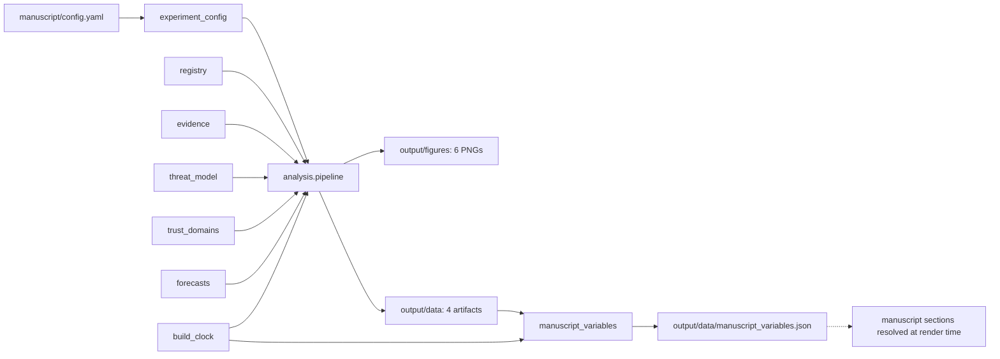

# architecture.md — agentic_os_security

A standalone, private research project: deep review + prospectus of agentic security and operating systems (OpSec, cognitive security, agentic cyber security). Layers: `src/` (pure), `scripts/` (thin), `manuscript/` (conventions), `output/` (disposable).

## src/ module map (`src/agentic_os_security/`)

Pure Python + matplotlib. **No `infrastructure` imports anywhere in `src/`.** Import name: `agentic_os_security`.

| Module | Owns |
|---|---|
| `registry.py` | The candidate×property×scenario backbone: dataclasses `Property`, `Candidate`, `Scenario`; constants `PROPERTIES` (9), `CANDIDATES` (24), `SCENARIOS` (8); helpers `matrix_rows()` (24×9 = 216 rows), `stance_counts()`, `category_counts()`, `candidates_by_category()`. Stance vocabulary: `strong \| partial \| weak \| n_a`. |
| `evidence.py` | `Source` dataclass (key, title, publisher, year, url, tier, claims); `SOURCES` — 65 documented sources keyed to the 65 source-derived bib keys; `CAPABILITY_BASELINE` (capability horizon 2027; Anthropic report: 30 targeted entities; AISI: 122 runs, 10 unsanctioned, incident days 2026-07-25..28; aiXcc 2025; QSB fix package; NixOS support dates); `sources_by_tier()`. |
| `threat_model.py` | `FAILURE_PATHS` (exploitation vs authorized misuse, each with definition + boundary implication), `ADVERSARY_ASSUMPTIONS`, `AUTHORITY_LADDER` (propose → stage → authorize → exercise → audit → revoke), `AGENT_CAPABILITY_CLASSES` (content intake, tool/bridge use, credential touch, external comms, state mutation, self-modification). |
| `trust_domains.py` | `TRUST_DOMAINS` (7: administration, personal_identity, credential_service, agent_execution, browsing_intake, release_deployment, recovery), `CONTROLS` (9: scoped credentials, egress boundary, external approvals, operation mediation, minimal shared state, environment refresh, tool-bridge constraining, independent audit, rehearsed recovery), `CONFIGURATION_INVARIANTS` (9 things an agent must never be able to do). |
| `forecasts.py` | `Forecast` dataclass (claim, confidence, horizon tuple); `FORECASTS` with confidence vocabulary `high \| moderate \| low`, horizon 2028–2031; `counts_by_confidence()`. |
| `build_clock.py` | Deterministic time: `build_timestamp()`, `build_date()`, `build_epoch()`; honors `SOURCE_DATE_EPOCH`, falls back to the review date (2026-09-10 noon UTC). The **only** clock in the project. |
| `project_paths.py` | `find_project_root()` plus `output_dir()`, `figures_dir()`, `data_dir()` — no path literals scattered elsewhere. |
| `experiment_config.py` | Loads and validates the `experiment:` block of `manuscript/config.yaml`; raises `ExperimentConfigError` on missing/invalid keys. |
| `manuscript_variables.py` | `generate_variables()` → every `{{TOKEN}}` in `manuscript/*.md` as a string; `save_variables()`. |
| `figures/` (package) | `_common.py` (Agg backend, deterministic rcParams, colorblind-safe palette, `apply_style()`, `save_figure()`) + six generators: `evidence_timeline`, `property_matrix`, `trust_domains`, `authority_ladder`, `orchestration_boundaries`, `forecast_horizon`. Each exposes `generate_<name>(project_root) -> Path`. |
| `analysis/` (package) | `pipeline.py::run_analysis(project_root) -> dict` — writes the four data artifacts (see below) and generates all six figures; returns a summary dict. |

## Scripts (`scripts/`, thin orchestrators)

| Script | Purpose | Exit codes |
|---|---|---|
| `00_preflight.py` | Environment, dependency, and directory checks | 0 ok / 1 fail |
| `10_evaluation_analysis.py` | Runs `analysis.pipeline.run_analysis` | 0 ok / 1 fail |
| `z_generate_manuscript_variables.py` | Token pipeline → `output/data/manuscript_variables.json`; injects into the template repo only when a template root is detected; standalone mode skips injection | 0 ok / 1 fail |

## Data flow

## output/ artifacts

- `output/figures/` — 6 deterministic PNGs, 300 dpi, colorblind-safe.
- `output/data/` — `evaluation_matrix.csv` (216 rows), `scenario_recommendations.csv` (8 rows), `evidence_summary.json`, `validation_report.json`, plus `manuscript_variables.json` from the variables script.
- `output/reports/` — human-readable run summaries.

Everything under `output/` is disposable: regenerate, never hand-edit.

## Boundaries

- No wall-clock anywhere in artifact generation (only `build_clock.py`).
- No network access at figure/analysis time.
- `tests/` (zero-mock, ≥90% coverage gate on `src/`) and `data/claim_ledger.yaml` close the loop between constants, artifacts, and prose claims.
