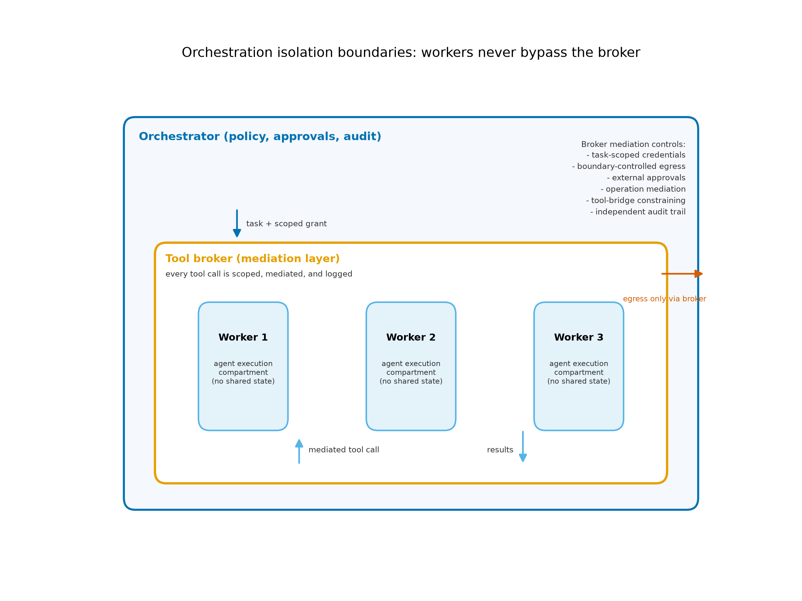
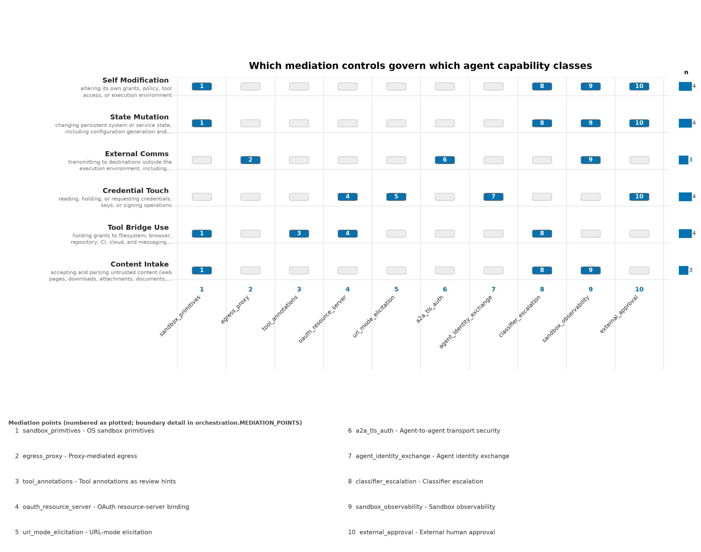

# Securing Agent Orchestration: Mediation Points Across Protocols {#sec:orchestration}

Multi-agent systems introduce a security surface that single-agent analysis misses: the orchestration layer that decomposes tasks, dispatches workers, aggregates results, and holds credentials on their behalf. Compartmentalization at the operating-system layer separates trust domains, but an orchestration layer recreates privileged intermediaries in software above the OS. If that layer is compromised — or merely persuaded — every domain it can reach is reachable at once. This section treats orchestration as a first-class security surface with its own trust boundaries, its own least-privilege requirements, and its own audit obligations, extending the authority architecture of [@sec:agentic_authority]. Its organizing device is a taxonomy of mediation points: the ten places where an orchestration stack can interpose a check between an agent's capability and an agent's action.

## The orchestrator as privileged intermediary

The orchestrator concentrates three kinds of authority. Through task decomposition it decides which worker sees which material, and so controls the information flow that determines what each agent can be influenced by. Through result aggregation it decides which outputs are promoted, and so hostile content that reaches it can be laundered into accepted results. Through credential custody it mints, distributes, and revokes task credentials, and so its own compromise is credential compromise for every task it supervises. Under the evaluation framework of [@sec:evaluation_framework], the trusted-computing-base question reappears one layer up: which components must remain correct for the compartmentalization below to matter. An orchestrator with unconstrained reach is that answer's weakest term, and treating it as a convenience rather than a security component is the first orchestration failure.

## Planner, executor, tool broker: where authority concentrates

The common pattern splits three roles. The planner decomposes intent into assignments. Executors run one task each inside isolated environments — disposable VMs or comparable workers, matching the agent-hosting baseline of [@sec:servers]. The tool broker mediates every privileged operation the executors request across filesystem, browser, repository, CI, cloud, and messaging APIs. Authority concentrates at two points: the planner, whose instructions workers accept as legitimate, and the broker, whose policy decides which operations pass. Both deserve the scrutiny the trusted-computing-base property demands.

The broker is where complete mediation [@saltzer1975] either happens or fails. Qubes' qrexec is the mature precedent: every inter-domain request traverses a policy-mediated channel, and the policy — not the requesting domain — decides what passes [@qubes_qrexec]. An orchestration tool broker should carry the same property: executors never touch API endpoints directly; the broker validates each requested operation against task-scoped policy and forwards only what passes. Where a deployment skips the broker and lets executors call cloud or messaging APIs directly, the orchestration diagram flatters a system that has, in authority terms, a single wide domain.

## Least-privilege orchestration

Least privilege [@saltzer1975] applied to orchestration yields concrete rules. Each task receives credentials minted for its scope and expiry — per-task credentials — never the operator's standing identity ([@sec:opsec]). Authority transfers between components as capability handoffs: narrow, unforgeable references to specific operations rather than ambient tokens, in the tradition of capability-based systems [@levy1984]. The IETF draft on AI-agent authentication composes SPIFFE/WIMSE workload identity with OAuth 2.0 token exchange (RFC 8693) and transaction tokens in exactly this direction: a short-lived, audience-bound credential per delegation hop [@ietf_agent_identity]. Executors hold no direct network or API authority beyond the broker channel. Workers exchange artifacts through the broker rather than through a shared home directory or scratch volume, because shared mutable state accumulates authority — whatever lands there becomes reachable by every later task that shares it, which is the minimal-shared-state control of [@tbl:controls] restated structurally.

Published deployment guides for cognitive-integrity controls give the worker tier the same treatment as a checklist: subagent-hardening playbooks that specify a disposable executor's environment, grant set, and intake handling as configuration to be reviewed rather than platform defaults to be inherited [@cif_practitioner_2026].

## Protocol-level mediation: MCP and A2A

The orchestration layer is acquiring standards of its own, and their evolution tracks the mediation points this section describes. The Model Context Protocol's June 2025 revision recast MCP servers as OAuth resource servers: protected-resource metadata (RFC 9728), tokens bound to the audience of the server they call (RFC 8707), OAuth 2.1 with PKCE [@mcp_spec_changelog]. Audience-bound tokens are the protocol-level version of the capability handoff above: a token stolen from one MCP server is useless at another. The same revision introduced tool annotations — hints such as `readOnlyHint` that a server attaches to its tools — and is explicit that they are advisory metadata for display and heuristics, not security guarantees [@mcp_tools_annotations]; the annotation is a claim by the mediated component, and the broker that mediates the call is what complete mediation requires.

Later revisions push further along the same axes. A server registry preview launched in September 2025 reached roughly 2,000 entries by November 2025, with governance denylists excluding known-malicious servers — an imperfect supply-chain screen at the point where operators choose which servers to trust [@mcp_registry_preview]. The November 2025 specification adds SEP-1024's local-installation security requirements, making a local server install a reviewed event rather than a silent privilege grant; SEP-835's default scopes, so a client requests the narrowest functioning scope set and expansion is explicit; and SEP-1036's URL-mode elicitation, moving interactive authorization into a browser-based OAuth flow in which the client never handles the user's credentials [@mcp_spec_2025_11]. The A2A protocol, developed under the Linux Foundation, makes the same choices for agent-to-agent traffic: mandatory TLS, standard HTTP authentication, remote agents treated as opaque [@a2a_protocol]. Neither protocol answers the authority question alone; each standardizes the channel on which a broker policy, an identity exchange, or an approval gate is enforced.

## Swarm threat models: MAESTRO, AegisSwarm, and the agent as insider

Threat-modeling frameworks now treat the multi-agent layer as a named object. The Cloud Security Alliance's MAESTRO models agentic AI threats across seven layers, from model and memory through tools and orchestration to the human-agent interface — the layered decomposition this review applies, with orchestration as the point where component failures compound [@csa_maestro]. CSA's AegisSwarm zero-trust swarm architecture draws the conclusion directly: an interception and auditing boundary around every agent, short-lived identities, and no persistent credentials anywhere in the swarm [@csa_securing_swarm] — the orchestration-layer restatement of this section's rules.

CSA's "Agents in the Wire" work names the insider-threat version: an agent compromised — or steered — while holding legitimate credentials is functionally an insider, with an employee's access and whatever judgment its context carries [@csa_agent_insider]. The detection posture insider-threat practice implies — behavioral baselines, per-operation review of unusual requests, audit channels the monitored principal cannot rewrite [@nist_sp800_207] — reappears below as the observability and escalation mediation points.

## Delegation chains and the confused deputy

An agent-to-agent delegation chain is a sequence of deputies. Lampson's protection analysis frames the general problem of a program exercising authority on a client's behalf [@lampson1974], and Hardy's confused-deputy case gives the failure its mechanism: a program holding more authority than its clients can be tricked into exercising that authority on an attacker's behalf by shaping the request's contents rather than its provenance [@hardy1988]. Multi-agent orchestration industrializes this shape. Each delegation hop adds an interpretation step in which attacker-influenced context — a poisoned repository, hostile content in an earlier worker's result, a crafted issue or document — can reshape what the next agent believes it was asked to do. The orchestrator then forwards the reshaped request under its own legitimate credentials: the confused deputy with an API surface, and with standing authority no individual worker possesses.

The mitigation is structural rather than behavioral. Authority must never be derived from message content: the broker validates the operation itself — artifact identity, destination, scope, expiry — not the orchestrator's description of the operation. Artifacts crossing a delegation boundary are integrity-checked and provenance-recorded before they influence any downstream request. And delegation can only narrow authority: a worker returns requests that preserve or reduce scope, never requests that expand it, and the broker rejects expansions as a matter of policy. These three rules convert the deputy from a trusted forwarder into a checked channel.

The formal grounding for these rules is δ-bounded delegation ([@def:delegation_bound]): each hop in an agent-to-agent chain is permitted to narrow the authority it passes, never to widen it, so trust cannot amplify across a delegation chain no matter how many intermediaries it traverses [@cif_formal_2026]. The bound of [@eq:delegation_bound] is not left as a statement of intent — its bounded-delegation and trust-boundedness properties have been exercised computationally, with implementations validating the no-amplification guarantee on constructed delegation scenarios [@cif_validation_2026].

::::: {.definition #def:delegation_bound title="δ-bounded delegation"}
For a delegation chain a→b→c, trust does not amplify:
$$\mathrm{trust}(a \to c) \le \delta \cdot \mathrm{trust}(a \to b)$$ {#eq:delegation_bound}
:::::

{#fig:orchestration_boundaries width=100%}

The boundaries in [@fig:orchestration_boundaries] are the orchestration-layer rendering of the trust-domain design: executors instantiate the `agent_execution` domain, broker policy carries the `credential_service` restrictions, external approval embodies the `administration` and `release_deployment` requirements, and the audit trail belongs to the recovery domain of [@tbl:trust_domains].

## The mediation-point taxonomy

The mechanisms reviewed in this section reduce to ten mediation points: places where an orchestration stack can interpose a check between an agent capability and an agent action. Each is already instantiated in deployed systems rather than proposed for the future.

1. **Sandbox primitives** — the process/host boundary: bubblewrap, Seatbelt, and Landlock restrict filesystem, process, and namespace reach before any tool call happens [@anthropic_sandboxing; @codex_sandboxing; @linux_landlock_docs].
2. **Egress proxy** — the agent/network boundary: outbound traffic passes a proxy whose allowlist, not the agent's request text, decides the destination [@anthropic_sandboxing].
3. **Tool annotations** — advisory capability metadata on MCP tools; useful for surfacing risk to humans, explicitly not a guarantee [@mcp_tools_annotations].
4. **OAuth resource-server binding** — protected-resource metadata per RFC 9728 and audience-bound tokens per RFC 8707, so a credential presented anywhere else fails [@mcp_spec_changelog].
5. **URL-mode elicitation** — browser-based authorization in which the client never handles user credentials [@mcp_spec_2025_11].
6. **Agent-to-agent transport security** — A2A's mandatory TLS and standard HTTP authentication between opaque agents [@a2a_protocol].
7. **Agent identity exchange** — SPIFFE/WIMSE workload identity with RFC 8693 token exchange and transaction tokens for short-lived, downscoped delegation [@ietf_agent_identity].
8. **Classifier escalation** — actions an automated classifier flags as resembling misuse are routed through two-stage review, as in Anthropic's auto-mode containment design [@claude_code_auto_mode].
9. **Sandbox observability** — audit instrumentation at the sandbox boundary, such as gVisor's SecCheck, recording what the agent attempted independently of what it reports [@gvisor_seccheck].
10. **External approval** — the human or deterministic-policy gate for consequential actions, outside the proposing hierarchy ([@tbl:controls]).

Mapped against the agent capability classes of [@sec:agentic_authority] — content intake, tool and bridge use, credential touch, external communication, state mutation, self-modification — the taxonomy shows where mechanical coverage exists. External communication crosses points 2, 4, and 6; credential touch crosses 4, 5, and 7; state mutation and self-modification are contained by 1 and audited by 9; tool and bridge use is broker-mediated under policy informed by 3. Content intake has no mechanical point at all — hostile content enters through any permitted channel — which is why the cognitive-security analysis of [@sec:cognitive_security] and the external-approval point 10 carry the weight mediation cannot. The coding-agent platforms' convergence on points 1, 2, and 8 — OS-primitive sandboxing, proxy egress, classifier escalation [@anthropic_sandboxing; @codex_sandboxing; @gemini_cli_sandbox] — before the protocol work standardizes points 4 through 7, is the market's own vote on where control belongs. [@fig:agent_surface] arranges the matrix, with the numbered mediation points keyed to the list above.

{#fig:agent_surface width=100%}

## Approval chains across agent hierarchies

The configuration invariant that no component may approve its own policy changes ([@sec:configuration_authorization]) applies with full force here: an orchestrator that can propose a consequential operation and also approve it has collapsed the separation between proposal and authorization that the authority ladder of [@sec:agentic_authority] maintains across its rungs. Approval must originate outside the hierarchy — a human principal, or a deterministic policy check with no stake in the task's completion. A second AI instance reading the same hostile material is not an independent approval boundary: it shares the attacker's channel into the first agent's context ([@sec:cognitive_security]). Approval context should carry the operation's full parameters — artifact, destination, scope, expiration — so the approver decides about the actual operation rather than about a summary of it; and the approval path itself, like the transfer paths of [@sec:qubes], is a high-value component whose compromise routes around every other control.

## Auditability of multi-agent decisions

Multi-agent decisions are hard to reconstruct because intent is distributed: no single transcript contains why a task evolved as it did, and agent prose is a poor record of authority events. The audit obligation ([@tbl:controls], independent audit) therefore attaches to the structure. Record every tool-broker decision with its full request context; record every credential mint, use, and revocation; record every delegation edge — which planner asked which worker for what, with which inputs and which returned artifacts. The record lives outside every agent's write authority and outside the orchestrator's, because rewriting the audit trail is one of the {{CONFIG_NUM_INVARIANTS}} configuration invariants of [@sec:configuration_authorization]. Sandbox-boundary observability is the enforcement instrument for the agent-side half of this obligation: an instrumentation point such as gVisor's SecCheck records system-level behavior at the sandbox edge, which is the record an operator can compare against what the agent narrated [@gvisor_seccheck]. Make the record useful for reconstructing what happened: timestamps, operation parameters, policy verdicts, and approver identities, not collected narration.

## Mapping to the trust-domain architecture

The mapping closes the loop with [@sec:agentic_authority]. The orchestrator's decomposition and aggregation role sits adjacent to `administration`, with no standing production credentials of its own. Executors instantiate `agent_execution` under its restrictions: no host home, no broad credential directory, no ambient production session. The broker instantiates the `credential_service` discipline: it exposes specific operations, not raw secrets or shells. Result intake applies the `browsing_intake` restrictions: aggregated worker output is untrusted material, reviewed before promotion. Deployment endpoints apply the `release_deployment` rule: agents may propose, but external approval must be unalterable by any of the proposing parties. The audit trail and known-good configuration instantiate `recovery`, beyond the destructive authority of everything above them. Orchestration does not replace this architecture; it is the layer where the architecture's rules are either enforced by construction or quietly dissolved by convenience.