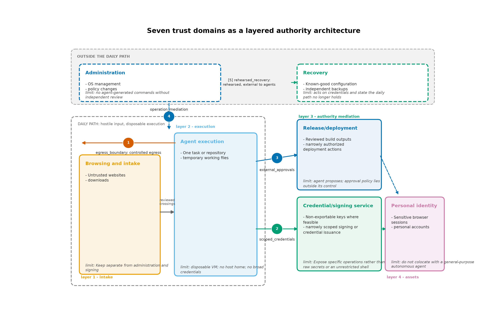

# Manuscript Syntax Reference (agentic_os_security)

Project-specific overlay on the canonical [`docs/guides/manuscript-semantics.md`](../../../../docs/guides/manuscript-semantics.md) — read that file first; this file documents the **agentic_os_security**-specific figure registry, section labels, and `{{TOKEN}}` table.

## Citation Syntax (Pandoc)

```markdown
<!-- Single citation -->
[@qubes_architecture]

<!-- Multiple citations -->
[@ncsc_ai_cyber_threat; @aisi_incident_report]

<!-- Narrative citation -->
@hardy1988 describes the confused deputy...
```

All citation keys must exist in [`references.bib`](references.bib). Pandoc with `--natbib` converts `[@key]` to the right LaTeX cite command automatically; **never** write raw `\cite{}` in Markdown.

**Key parity is enforced by tests** (`tests/test_evidence.py`, `tests/test_manuscript_structure.py`): every citation key used in prose must exist in `references.bib`; the bibliography has 156 entries (150 primary sources + 6 scholarly anchors), extended in the v0.2.0 round (review date 2026-09-11).

## Figure References

```markdown
{#fig:trust_domains width=100%}

<!-- Reference in text -->
[@fig:trust_domains] shows...
```

- Images must exist in `output/figures/` at render time (run the analysis pipeline first)
- Captions are self-contained — they appear in the PDF and as alt text in HTML
- Never hardcode figure numbers; use Pandoc-crossref labels

### Figure label registry

| Label | PNG filename | Generator in `src/agentic_os_security/figures/` |
|---|---|---|
| `{#fig:evidence_timeline}` | `output/figures/evidence_timeline.png` | `generate_evidence_timeline()` |
| `{#fig:property_matrix}` | `output/figures/property_matrix.png` | `generate_property_matrix()` |
| `{#fig:trust_domains}` | `output/figures/trust_domains.png` | `generate_trust_domains()` |
| `{#fig:authority_ladder}` | `output/figures/authority_ladder.png` | `generate_authority_ladder()` |
| `{#fig:orchestration_boundaries}` | `output/figures/orchestration_boundaries.png` | `generate_orchestration_boundaries()` |
| `{#fig:forecast_horizon}` | `output/figures/forecast_horizon.png` | `generate_forecast_horizon()` |
| `{#fig:defensive_stack}` | `output/figures/defensive_stack.png` | `generate_defensive_stack()` |
| `{#fig:update_windows}` | `output/figures/update_windows.png` | `generate_update_windows()` |
| `{#fig:agent_surface}` | `output/figures/agent_surface.png` | `generate_agent_surface()` |

## Table References

```markdown
| Candidate | Strength | Limit |
| --- | --- | --- |

: Desktop candidates compared {#tbl:desktops}

<!-- Reference in text -->
[@tbl:desktops] summarizes...
```

### Table label registry

| Label | Caption summary | Source file |
|---|---|---|
| `{#tbl:properties}` | Nine evaluation properties | `03_evaluation_framework.md` |
| `{#tbl:offensive_evidence}` | Offensive-AI evidence and caveats | `02_threat_model.md` |
| `{#tbl:qubes_limits}` | What Qubes does not buy | `04_compartmentalization_qubes.md` |
| `{#tbl:nixos_misconceptions}` | NixOS misconceptions vs documented facts | `05_reproducible_operations_nixos.md` |
| `{#tbl:desktops}` | Desktop candidate comparison | `06_conventional_desktops.md` |
| `{#tbl:servers}` | Server candidate comparison | `07_servers_agent_infrastructure.md` |
| `{#tbl:comparators}` | Non-Linux boundary comparators | `08_boundary_comparators.md` |
| `{#tbl:trust_domains}` | Trust-domain contents and restrictions | `09_agentic_authority_architecture.md` |
| `{#tbl:controls}` | Control catalog | `09_agentic_authority_architecture.md` |
| `{#tbl:invariants}` | Configuration review invariants | `13_configuration_authorization.md` |
| `{#tbl:scenarios}` | Scenario recommendations | `15_scenarios_and_confidence.md` |
| `{#tbl:confidence}` | Confidence tiers and evidence limits | `15_scenarios_and_confidence.md` |

## Section Labels

Every H1 carries a `{#sec:<name>}` label so cross-section references survive reordering:

| File | Section H1 | Label |
|---|---|---|
| `00_abstract.md` | Abstract | `{#sec:abstract}` |
| `01_introduction.md` | Introduction: Agents Arrive at the Kernel Boundary | `{#sec:introduction}` |
| `02_threat_model.md` | Threat Model: Two Ways to Lose | `{#sec:threat_model}` |
| `03_evaluation_framework.md` | Evaluation Framework: Properties over Labels | `{#sec:evaluation_framework}` |
| `04_compartmentalization_qubes.md` | Compartmentalization: Qubes OS in Depth | `{#sec:qubes}` |
| `05_reproducible_operations_nixos.md` | Reproducible Operations: NixOS in Depth | `{#sec:nixos}` |
| `06_conventional_desktops.md` | Conventional Desktops and Hardening Candidates | `{#sec:desktops}` |
| `07_servers_agent_infrastructure.md` | Servers and Agent-Execution Infrastructure | `{#sec:servers}` |
| `08_boundary_comparators.md` | Boundary Comparators and Non-Linux Systems | `{#sec:comparators}` |
| `09_agentic_authority_architecture.md` | Agentic Authority Architecture | `{#sec:agentic_authority}` |
| `10_cognitive_security.md` | Cognitive Security: The Authorized-Misuse Surface | `{#sec:cognitive_security}` |
| `11_opsec_for_agent_operators.md` | Operator OpSec for Agent Work | `{#sec:opsec}` |
| `12_orchestration_security.md` | Securing Agent Orchestration | `{#sec:orchestration}` |
| `13_configuration_authorization.md` | Configuration Generation Is Not Authorization | `{#sec:configuration_authorization}` |
| `14_forecast_2028_2031.md` | Forecast: 2028–2031 | `{#sec:forecast}` |
| `15_scenarios_and_confidence.md` | Scenario Recommendations and Confidence | `{#sec:scenarios}` |
| `16_conclusion.md` | Conclusion: The Composition That Matters | `{#sec:conclusion}` |
| `99_references.md` | References | `{#sec:references}` |

## Preamble Injection

[`preamble.md`](preamble.md) contains the LaTeX packages that Pandoc consumes via `infrastructure.rendering.latex_utils`:

```markdown
---
header-includes:
  - \usepackage{amsmath}
  - \usepackage[capitalise,noabbrev]{cleveref}
  - \usepackage{natbib}
---
```

- Preamble is parsed by `infrastructure/rendering/latex_utils.py`
- Do **not** duplicate package imports already in the infrastructure renderer

## BibTeX Entry Format

```bibtex
@misc{qubes_architecture,
  author       = {{Qubes OS Project}},
  title        = {Qubes OS Architecture},
  year         = {2026},
  howpublished = {\url{https://doc.qubes-os.org/en/latest/developer/system/architecture.html}}
}
```

- Keys must be lowercase alphanumeric with optional underscores
- Organizational authors use `{Braced Organization}` form
- All entries must have at minimum: `author` (or organization), `title`, `year`
- URLs use `howpublished = {\url{...}}` (official documentation) or `note = {Accessed 2026-09-10}` where appropriate

## Section Numbering

```text
00_abstract.md                        → Abstract (unnumbered in PDF)
01_introduction.md                    → Section 1
02_threat_model.md                    → Section 2
...                                   → ...
16_conclusion.md                      → Section 16
99_references.md                      → References (Pandoc--natbib bibliography)
```

Files are assembled in lexicographic order by `infrastructure/rendering/pdf_renderer.py`.

## Prose Conventions

- No "In summary" or "In conclusion" at section ends (RASP standard)
- Use active voice for design descriptions
- Use explicit paths when referencing code: `src/agentic_os_security/registry.py`, not "the registry module"
- Assessments are analytical judgments from documented designs and advisories — never presented as penetration-test results; no numeric security scores ("Qubes 9.4" style) anywhere
- No ```mermaid``` blocks in manuscript files (the combined-PDF render requires a browser shell for those; this project expresses diagrams as generated PNG figures)

## See Also

- [`../../../docs/guides/manuscript-semantics.md`](../../../../docs/guides/manuscript-semantics.md) — Repository-wide canonical semantics
- [`AGENTS.md`](AGENTS.md) — RASP protocol and AI agent constraints
- [`../docs/rendering_pipeline.md`](../docs/rendering_pipeline.md) — Full rendering flow
- [`../docs/syntax_guide.md`](../docs/syntax_guide.md) — `{{VARIABLE}}` token reference
- [`preamble.md`](preamble.md) — Active LaTeX preamble